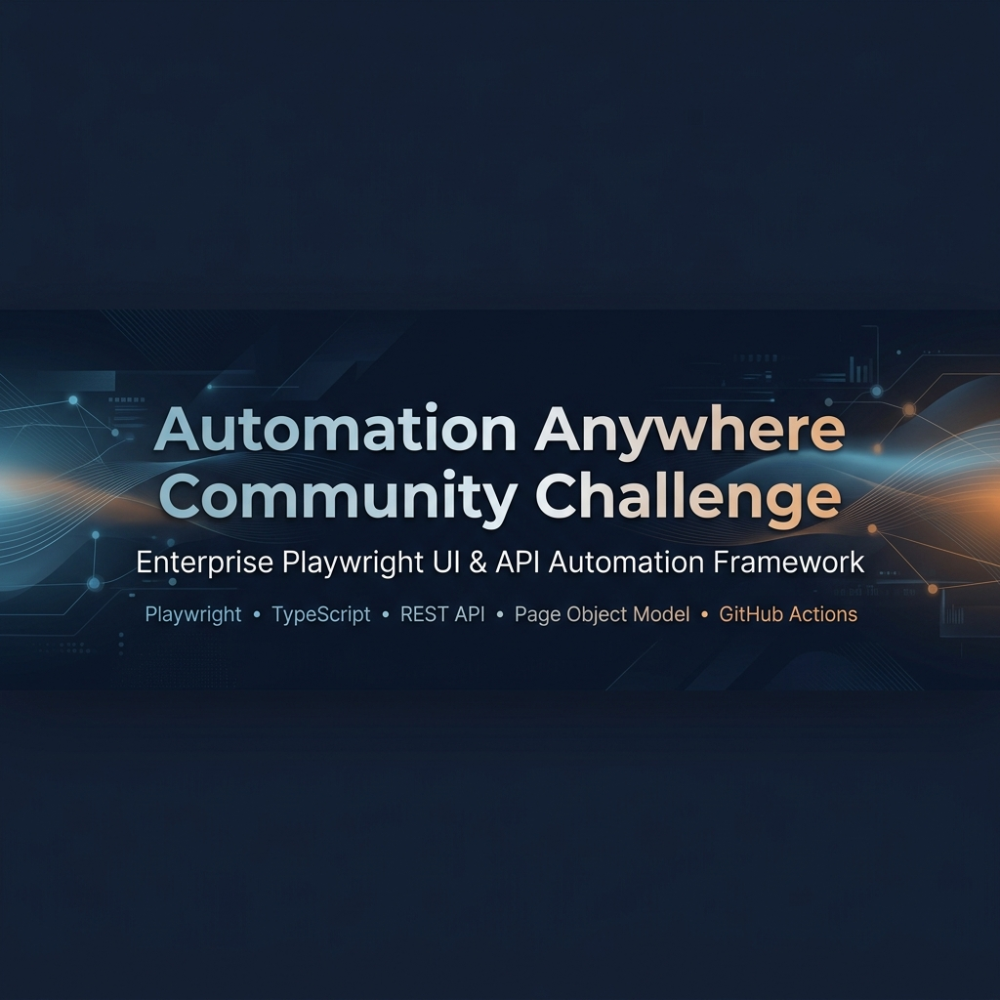
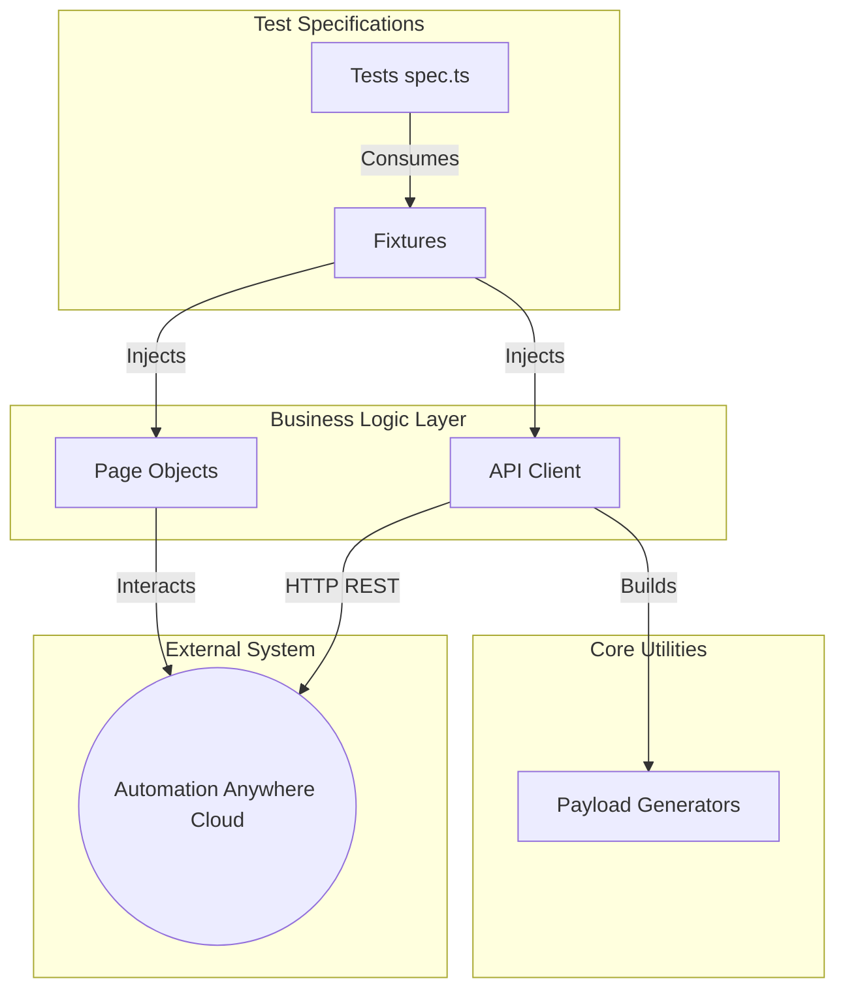
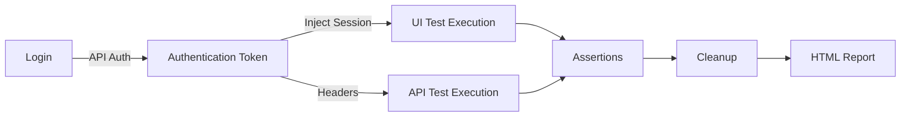
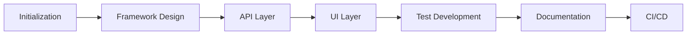

<a id="readme-top"></a>

<div align="center">
  

<br><br>

  <h1>Automation Anywhere Community Challenge</h1>

  <p>
    <strong>Enterprise Playwright UI & API Automation Framework.</strong>
  </p>

<p align="center">
  
  
  
  
  
  
</p>

  <p>
    <a href="#-what-youll-find-in-this-repository">Overview</a> •
    <a href="#-project-showcase">Features</a> •
    <a href="#-architecture">Architecture</a> •
    <a href="#-getting-started">Installation</a> •
    <a href="#-implemented-use-cases">Usage</a> •
    <a href="#-quality-checklist">CI/CD</a> •
    <a href="#-license">License</a>
  </p>
</div>

<hr />

## 📦 Release Information

| Current Version | Release Status | Last Updated |      Compatibility      |   Node Version    | Playwright Version |
| :-------------: | :------------: | :----------: | :---------------------: | :---------------: | :----------------: |
|    `v1.0.0`     |   **Stable**   |   2026-07    | macOS / Linux / Windows | `v18.x` / `v20.x` |     `^1.61.0`      |

---

## 💼 What You'll Find in This Repository

This repository demonstrates:

- **UI Automation**: Resilient, cross-browser validation of complex `iframe` interfaces.
- **API Automation**: Direct HTTP state manipulation, bypassing brittle UI setup steps.
- **Test Architecture**: Strict separation of concerns leveraging the Page Object Model (POM).
- **Maintainable Design**: Extracted locators, utility pure-functions, and encapsulated API clients.
- **CI/CD Integration**: Fully functional GitHub Actions pipelines failing builds on regressions.
- **Documentation Quality**: Enterprise-grade onboarding, technical diagrams, and visual references.

<p align="right"><a href="#readme-top">⬆️ Back to Top</a></p>

---

## 📊 Project Statistics

| Category            | Details                      |
| :------------------ | :--------------------------- |
| **Repository Type** | Automation Testing Framework |
| **Language**        | TypeScript (Strict Mode)     |
| **Framework**       | Playwright                   |
| **Testing**         | UI + API Integration         |
| **Architecture**    | Page Object Model (POM)      |
| **Reporting**       | Playwright HTML Reporter     |
| **CI/CD**           | GitHub Actions               |

<p align="right"><a href="#readme-top">⬆️ Back to Top</a></p>

---

## ⭐ Project Showcase

This repository is engineered to validate the Automation Anywhere Community Cloud. It demonstrates:

- **Modern Playwright Automation:** Utilizing auto-waiting, trace viewers, and native web-first assertions.
- **REST API Testing:** Encapsulated HTTP clients verifying status codes, headers, and complex JSON schemas.
- **UI Automation:** Robust interactions across deeply nested Web components.
- **Page Object Model:** Class-based encapsulation of DOM locators keeping test specifications clean.
- **CI/CD:** Automated testing triggers enforcing quality gates on Pull Requests.
- **Professional Documentation:** Deep architectural insights designed for engineering teams.

<p align="right"><a href="#readme-top">⬆️ Back to Top</a></p>

---

## 🏗 Architecture

> The diagram below illustrates the hierarchical flow of data and execution from the test layer down to the external cloud application.

<div align="center">
  
  <p><i>Figure 1 — Enterprise Framework Architecture.</i></p>
</div>



<p align="right"><a href="#readme-top">⬆️ Back to Top</a></p>

---

## 🔄 Execution Workflow

> The following diagram shows how UI execution and API execution complement one another in a single automated lifecycle.

<div align="center">
  
  <p><i>Figure 2 — End-to-End Test Execution Lifecycle.</i></p>
</div>



<p align="right"><a href="#readme-top">⬆️ Back to Top</a></p>

---

## 📂 Project Structure

> The image below illustrates the organized directory layout separating configuration, source logic, and assets.

<div align="center">
  
  <p><i>Figure 3 — Repository project structure viewed in an IDE.</i></p>
</div>

```text
📦 aa-community-automation
├── 📁 .github/workflows      # CI/CD pipeline definitions
├── 📁 config/                # Environment and API endpoint mappings
├── 📁 fixtures/              # Playwright custom fixtures
├── 📁 mock-server/           # Express.js local server for isolated API validation
├── 📁 pages/                 # Page Object Model (POM) classes
├── 📁 test-data/             # JSON schemas and static testing assets
├── 📁 tests/
│   ├── 📁 api/               # Headless REST API validation tests
│   └── 📁 ui/                # Browser automation workflows
├── 📁 utils/                 # Utilities (ApiClient, PayloadBuilders)
├── 📄 .env.example           # Environment variable template
├── 📄 .gitignore             # Ignored generated artifacts
├── 📄 playwright.config.ts   # Core execution configuration
└── 📄 package.json           # Dependencies and scripts
```

<p align="right"><a href="#readme-top">⬆️ Back to Top</a></p>

---

## 🧠 Engineering Standards

This repository adheres to strict software engineering standards to ensure long-term maintainability.

- **Modular Architecture:** Business logic is isolated from test assertions. Tests assert, classes act.
- **Separation of Concerns:** Environment configuration, API logic, and UI locators live in strictly delineated directories.
- **Reusable Page Objects:** Locators are defined once. If a CSS selector changes, it is updated in a single location.
- **Reusable API Client:** A dedicated HTTP wrapper abstracts JWT token injection and dynamic routing logic away from the test specifications.
- **Environment Isolation:** Secrets and URLs are injected via `dotenv`, preventing accidental exposure and allowing dynamic execution across Staging or Production.
- **Strong Typing:** TypeScript interfaces define payloads and API responses, catching schema regressions at compile time.
- **Maintainable Tests:** Eliminating implicit waits (`waitForTimeout`) in favor of Playwright's native auto-waiting mechanisms guarantees faster, non-flaky execution.
- **Scalable Design:** Separating UI and API test targets allows parallel test runners to shard efficiently.

<p align="right"><a href="#readme-top">⬆️ Back to Top</a></p>

---

## 🚀 Getting Started

### Installation

```bash
git clone https://github.com/PRATIKSK7/aa-community-automation.git
cd aa-community-automation
npm install
npx playwright install --with-deps
```

### Environment Configuration

Create a local environment file.

```bash
cp .env.example .env
```

Ensure your `.env` contains valid credentials:

```env
AA_USERNAME=your_username
AA_PASSWORD=your_password
AA_BASE_URL=https://community.cloud.automationanywhere.digital
AA_API_URL=https://community.cloud.automationanywhere.digital
USE_MOCK_API=false
```

### Running Tests

```bash
# Execute UI Tests
npm run test:ui

# Execute API Tests
npm run test:api

# Execute the entire suite
npm test
```

### Viewing Reports

```bash
npx playwright show-report
```

<p align="right"><a href="#readme-top">⬆️ Back to Top</a></p>

---

## 📖 Implemented Use Cases

<details open>
<summary><b>Use Case 1: Form Upload Flow (UI)</b></summary>
<br>

**Objective:** Validate form creation via the Automation Anywhere UI.

**Workflow:**

1. Authenticate via API and inject session state.
2. Navigate to the Automation Dashboard.
3. Access the Private Workspace and initialize Form Creation.
4. Interact within the Form Builder iframe.
5. Drag and drop elements (Text Box, File Upload) onto the canvas.
6. Save the Form.

**Expected Result:**

- Verify the "Form Saved Successfully" toast notification appears.

</details>

<details open>
<summary><b>Use Case 2: API Process Creation (API)</b></summary>
<br>

**Objective:** Validate programmatic generation of cloud workflows.

**Workflow:**

1. Execute `POST /v2/authentication` to acquire a JWT token.
2. Search the Workspace to dynamically resolve folder structures.
3. Execute `POST /v2/repository/files` to create a Form shell.
4. Hydrate the Form with a JSON payload via `PUT`.
5. Execute `POST /v2/repository/files` to create a Process shell.
6. Hydrate the Process and inject the Form as a strict dependency via `PUT`.
7. Cleanup test artifacts via `DELETE`.

**Expected Result:**

- API returns `201 Created` and `200 OK` for orchestration steps.

</details>

<p align="right"><a href="#readme-top">⬆️ Back to Top</a></p>

---

## 📈 Repository Timeline



<p align="right"><a href="#readme-top">⬆️ Back to Top</a></p>

---

## ✅ Quality Checklist

- [x] README Complete
- [x] Documentation
- [x] API Tests
- [x] UI Tests
- [x] Type Checking
- [x] Linting
- [x] GitHub Actions
- [x] Open Source Ready

<p align="right"><a href="#readme-top">⬆️ Back to Top</a></p>

---

## 🤝 Contributing

Contributions are welcome.

1. Fork the Project.
2. Create your Feature Branch (`git checkout -b feature/AmazingFeature`).
3. Commit your Changes (`git commit -m 'Add AmazingFeature'`).
4. Push to the Branch (`git push origin feature/AmazingFeature`).
5. Open a Pull Request.

<p align="right"><a href="#readme-top">⬆️ Back to Top</a></p>

---

## 👨‍💻 Author

**Pratik S Kanoj**

- **GitHub:** [PRATIKSK7](https://github.com/PRATIKSK7)
- **LinkedIn:** [pratik-s-kanoj-a81432300](https://www.linkedin.com/in/pratik-s-kanoj-a81432300/)

<p align="right"><a href="#readme-top">⬆️ Back to Top</a></p>

---

## 📜 License

Distributed under the MIT License. See [LICENSE](LICENSE) for more information.

<br>

<div align="center">
  <p><strong>Built with Playwright + TypeScript</strong></p>
  <p><i>Designed for maintainable UI & API automation.</i></p>
  <p>© 2026 Pratik S Kanoj</p>
  <p><a href="#readme-top">Back to Top</a></p>
</div>
